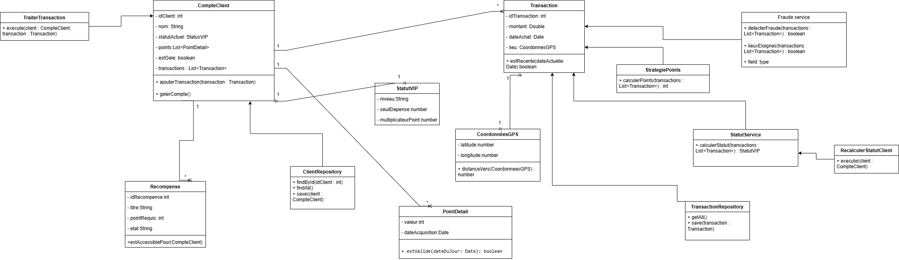

#  Architecture Applicative – Projet DDD (Fraude & Statut Client VIP)

Auteur: NOUDOUKOU FLORA
FORMATION: EPSI M1 SYSTEMES D'INFORMATION
MATIERE: ARCHITECTURE APLLICATIVE

## Description

Ce projet est une application backend développée en **Node.js (Express)** suivant les principes de **Domain Driven Design (DDD)** et de **Clean Architecture**.
Projet réalisé dans un contexte pédagogique pour la mise en pratique de l’architecture applicative avancée.

Il permet de :
- Gérer des clients et leurs transactions
- Calculer un statut VIP (BRONZE / SILVER / GOLD)
- Détecter des comportements frauduleux
- Appliquer une architecture en couches propre et maintenable

---

## Objectifs pédagogiques

- Mise en place d’une architecture DDD
- Séparation des responsabilités (Domain / Application / Infrastructure / Interface)
- Implémentation de services métiers
- Utilisation de Value Objects et Entities
- Tests unitaires avec Jest (Mocks & Stubs)
- Persistance simple via JSON

## Diagramme UML

## Architecture du projet

src/
├── application/ # Cas d'utilisation (use cases)
├── domain/ # Logique métier pure
│ ├── entities/
│ ├── services/
│ └── valueObjects/
├── infrastructure/ # Accès aux données (repositories)
  ├── repositories/
├── interface/ # API (controllers + routes)
  ├── routes/
│ ├── controllers/
data/ # Fichiers JSON (persistance)
tests/ # Tests unitaires (Jest)

##  Installation

### 1. Cloner le projet
git clone <repo-url>
cd <nom-projet>

2. Installer les dépendances
npm install

3. Lancer le serveur
node src/interface/server.js

Les tests sont réalisés avec Jest.

Lancer les tests :
npm test

Types de tests :
- Tests avec Stub (données fictives)
- Tests avec Mock (comportement simulé)
- Règles métier principales
- Statut VIP

Le statut est calculé sur les dépenses des 12 derniers mois :

GOLD → ≥ 2000€
SILVER → ≥ 1000€
BRONZE → < 1000€

♠ Détection de fraude

Une transaction est considérée comme suspecte si :

- déplacements géographiques incohérents
- comportements anormaux sur plusieurs transactions

♦ Technologies utilisées
- Node.js
- Express.js
- Jest
- Architecture DDD
- JSON (persistance simple)

♣ Design Patterns utilisés
- Repository Pattern
- Service Layer
- Value Object
- Domain Service
- Dependency Isolation

♣ Points forts du projet
- Architecture propre et scalable
- Séparation claire des responsabilités
- Code testable et maintenable
- Respect des principes SOLID
- Couverture de tests unitaires

♣ Améliorations possibles
- Passage à une base de données (SQLite / PostgreSQL)
- Ajout de Swagger pour documentation API
- Containerisation avec Docker
- Authentification JWT
- Logging avancé
